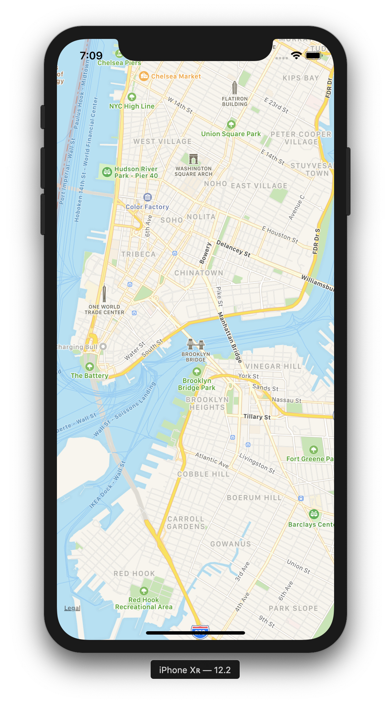

# 📲 Integrating Maps Into Your Apps
-
[](https://opensource.org/licenses/MIT) [](https://GitHub.com/Naereen/StrapDown.js/graphs/contributors/) [](https://github.com/ellerbrock/open-source-badges/) [](https://saythanks.io/to/kennethreitz)

[](https://GitHub.com/Naereen/)

[](https://forthebadge.com)



```swift
// Brooklyn Bridge coordinates -> 40.706606, -73.996746
        
        let latitude: CLLocationDegrees = 40.706606
        
        let longitude: CLLocationDegrees = -73.996746
        
        let lanDelta: CLLocationDegrees = 0.05
        
        let lonDelta: CLLocationDegrees = 0.05
        
        let span = MKCoordinateSpan(latitudeDelta: lanDelta, longitudeDelta: lonDelta)
        
        let coordinates = CLLocationCoordinate2D(latitude: latitude, longitude: longitude)
        
        let region = MKCoordinateRegion(center: coordinates, span: span)
        
        map.setRegion(region, animated: true)
        
```